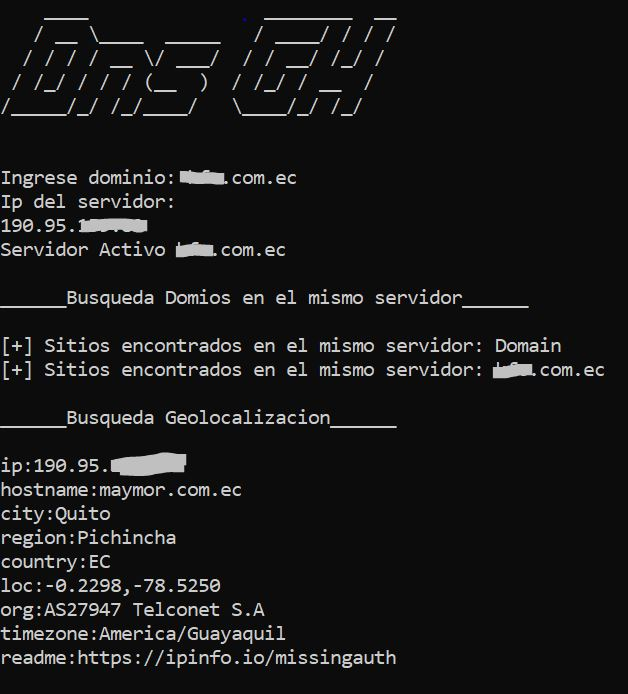
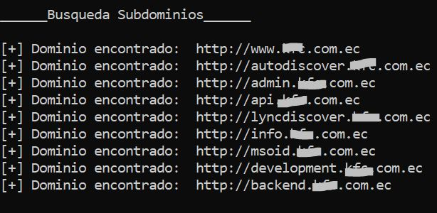

# Osint_Dns
This is a small python script that is used to extract basic information from a DNS server, using a few lines and a couple of Apis ... :)

You need to import some libraries, you can install them with pip

[+]import subprocess, socket, os, re

[+]from pyfiglet import Figlet

[+]import requests

[+]from bs4 import BeautifulSoup

[+]import urllib.request 

[+]import json

[+]import dns.resolver

Compare subdomain names found in base.txt file

